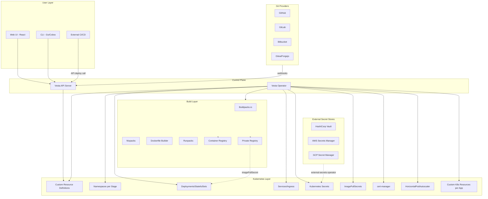
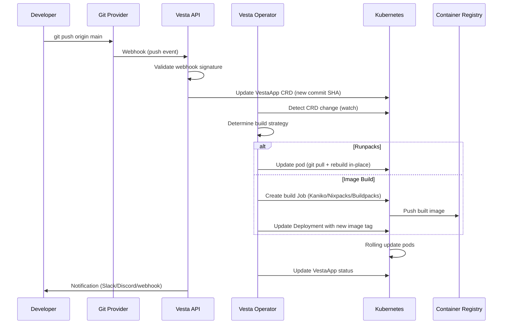
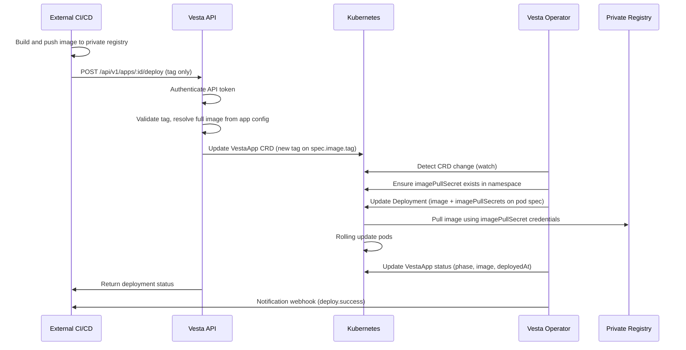
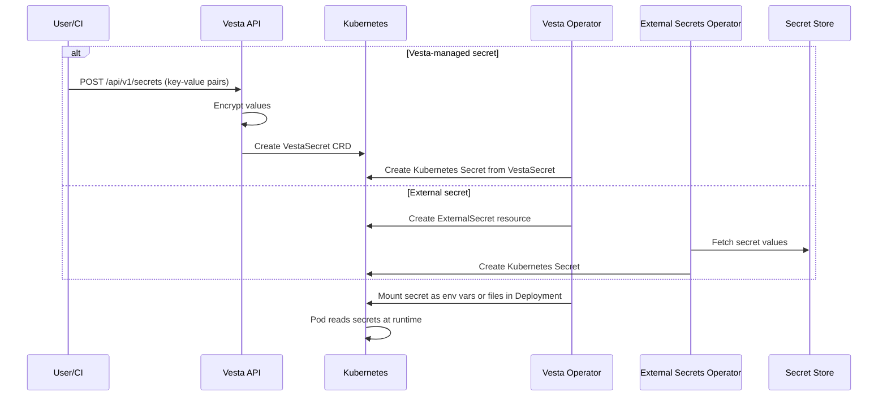

# Vesta Kubernetes -- Product & Technical Specification

## 1. Vision and Goals

**Vesta** is a self-hosted, open-source Platform-as-a-Service (PaaS) for Kubernetes that provides a Heroku-like developer experience. It enables teams to deploy applications via git push, API call, or pre-built image -- without writing Kubernetes manifests, Dockerfiles, or Helm charts.

**Core principles:**

- **Kubernetes-native** -- all state lives in CRDs/etcd; no external database for the control plane
- **Git as the source of truth** -- push-to-deploy, PR-based review apps, branch-per-stage
- **API-first** -- every operation is available via REST API, enabling CI/CD integration and programmatic deployments
- **Secrets-first** -- sensitive configuration is managed via Kubernetes Secrets (not plain env vars), with support for external secret stores
- **Minimal footprint** -- only two workloads: Vesta Operator + Vesta API/UI
- **Extensible** -- addon system backed by Kubernetes operators, pluggable build strategies, custom Kubernetes resource overrides per app

---

## 2. High-Level Architecture



**Components:**

- **Vesta API Server**: Handles UI/CLI/external requests, webhook ingestion, authentication, and writes CRDs to the Kubernetes API. Exposes deploy endpoints for programmatic deployments from CI/CD systems.
- **Vesta Operator**: Watches CRDs and reconciles desired state -- creates namespaces, deployments, services, ingress, secrets, imagePullSecrets, HPA, custom Kubernetes resources, triggers builds, manages addons.
- **Web UI**: Single-page application for managing pipelines, apps, secrets, addons, logs, and metrics.
- **CLI**: Command-line tool for all operations (install, pipeline/app CRUD, secret management, logs, exec).

---

## 3. Custom Resource Definitions (CRDs)

### 3.1 VestaApp

The primary CRD representing a deployed application. Supports secrets (not plain env vars), imagePullSecrets, custom Kubernetes config, autoscaling, and private registry deployment.

```yaml
apiVersion: kubernetes.getvesta.sh/v1alpha1
kind: VestaApp
metadata:
  name: my-app
  namespace: my-pipeline-production
spec:
  pipeline: my-pipeline
  stage: production

  # --- Source: Git-based or Image-based ---
  git:
    provider: github
    repository: org/my-app
    branch: main
    autoDeployOnPush: true

  build:
    strategy: nixpacks       # runpacks | buildpacks | dockerfile | image
    dockerfile: ./Dockerfile # only if strategy=dockerfile

  # --- Image deployment (from private or public registry) ---
  image:
    repository: registry.example.com/org/my-app
    tag: v1.2.3
    pullPolicy: IfNotPresent
    imagePullSecrets:
      - name: my-registry-secret       # references a K8s Secret of type kubernetes.io/dockerconfigjson
      - name: ghcr-pull-secret

  # --- Runtime Configuration ---
  runtime:
    port: 3000
    command: "npm start"
    args: ["--production"]

    # Plain environment variables (non-sensitive only)
    env:
      - name: NODE_ENV
        value: production
      - name: LOG_LEVEL
        value: info

    # Secrets -- all sensitive config goes here, NOT in env
    secrets:
      # Reference an existing Kubernetes Secret
      - secretRef:
          name: my-app-secrets
        # Optionally select specific keys to inject
        keys:
          - secretKey: DATABASE_URL
            envVar: DATABASE_URL
          - secretKey: API_KEY
            envVar: EXTERNAL_API_KEY

      # Reference individual secret key-value pairs
      - secretKeyRef:
          name: shared-secrets
          key: REDIS_PASSWORD
          envVar: REDIS_PASSWORD

      # Mount secrets as files (for certs, config files, etc.)
      - secretMount:
          name: tls-certs
          mountPath: /etc/ssl/app
          readOnly: true

    # Volume mounts for persistent data
    volumes:
      - name: data
        persistentVolumeClaim:
          claimName: my-app-data
        mountPath: /app/data

  # --- Autoscaling ---
  scaling:
    replicas: 2
    autoscale:
      enabled: true
      minReplicas: 1
      maxReplicas: 10
      metrics:
        - type: cpu
          targetAverageUtilization: 70
        - type: memory
          targetAverageUtilization: 80
        - type: custom
          name: http_requests_per_second
          targetAverageValue: "1000"
      behavior:
        scaleUp:
          stabilizationWindowSeconds: 60
          policies:
            - type: Percent
              value: 50
              periodSeconds: 60
        scaleDown:
          stabilizationWindowSeconds: 300
          policies:
            - type: Percent
              value: 25
              periodSeconds: 120

  # --- Resource Management ---
  resources:
    size: medium             # maps to podSizeList (quick preset)
    # OR explicit resource requests/limits (overrides size)
    requests:
      cpu: "500m"
      memory: "512Mi"
    limits:
      cpu: "1000m"
      memory: "1Gi"

  # --- Ingress ---
  ingress:
    domain: my-app.example.com
    tls: true
    clusterIssuer: letsencrypt-prod
    basicAuth: false
    annotations:
      nginx.ingress.kubernetes.io/proxy-body-size: "50m"

  # --- Cronjobs ---
  cronjobs:
    - name: cleanup
      schedule: "0 2 * * *"
      command: "npm run cleanup"
      resources:
        size: small

  # --- Addons ---
  addons:
    - type: postgresql
      version: "15"
      size: small
    - type: redis
      version: "7"

  # --- Sleeping Containers (scale-to-zero) ---
  sleep:
    enabled: false
    inactivityTimeout: 30m

  # --- Custom Kubernetes Configuration ---
  # Allows injecting arbitrary Kubernetes resource config per app.
  # The operator merges these into the generated Deployment/Service/etc.
  customConfig:
    # Additional labels applied to all generated resources
    labels:
      app.example.com/team: backend
      app.example.com/cost-center: engineering

    # Additional annotations applied to all generated resources
    annotations:
      prometheus.io/scrape: "true"
      prometheus.io/port: "9090"

    # Pod-level overrides merged into the Deployment's pod spec
    podSpec:
      serviceAccountName: my-app-sa
      nodeSelector:
        kubernetes.io/arch: amd64
        node-type: compute
      tolerations:
        - key: "dedicated"
          operator: "Equal"
          value: "app"
          effect: "NoSchedule"
      affinity:
        podAntiAffinity:
          preferredDuringSchedulingIgnoredDuringExecution:
            - weight: 100
              podAffinityTerm:
                labelSelector:
                  matchExpressions:
                    - key: app
                      operator: In
                      values: ["my-app"]
                topologyKey: kubernetes.io/hostname
      initContainers:
        - name: migrate
          image: registry.example.com/org/my-app:v1.2.3
          command: ["npm", "run", "migrate"]
          envFrom:
            - secretRef:
                name: my-app-secrets
      securityContext:
        runAsNonRoot: true
        runAsUser: 1000
        fsGroup: 1000
      dnsPolicy: ClusterFirst
      terminationGracePeriodSeconds: 60

    # Container-level overrides merged into the main app container
    containerSpec:
      livenessProbe:
        httpGet:
          path: /healthz
          port: 3000
        initialDelaySeconds: 15
        periodSeconds: 10
      readinessProbe:
        httpGet:
          path: /ready
          port: 3000
        initialDelaySeconds: 5
        periodSeconds: 5
      startupProbe:
        httpGet:
          path: /healthz
          port: 3000
        failureThreshold: 30
        periodSeconds: 10
      lifecycle:
        preStop:
          exec:
            command: ["/bin/sh", "-c", "sleep 10"]

    # Extra Kubernetes resources to create alongside the app
    # These are applied as-is by the operator
    extraResources:
      - apiVersion: v1
        kind: ConfigMap
        metadata:
          name: my-app-config
        data:
          config.yaml: |
            feature_flags:
              new_ui: true
      - apiVersion: networking.k8s.io/v1
        kind: NetworkPolicy
        metadata:
          name: my-app-netpol
        spec:
          podSelector:
            matchLabels:
              app: my-app
          ingress:
            - from:
                - namespaceSelector:
                    matchLabels:
                      name: my-pipeline-production

status:
  phase: Running
  buildStatus: Success
  url: https://my-app.example.com
  currentImage: registry.example.com/org/my-app:v1.2.3
  lastDeployedAt: "2026-03-26T10:00:00Z"
  lastCommitSHA: abc123def
  deploymentHistory:
    - version: 3
      image: registry.example.com/org/my-app:v1.2.3
      commitSHA: abc123def
      deployedAt: "2026-03-26T10:00:00Z"
      deployedBy: api-token:ci-deploy
    - version: 2
      image: registry.example.com/org/my-app:v1.2.2
      commitSHA: 789xyz
      deployedAt: "2026-03-25T14:00:00Z"
      deployedBy: user:john@example.com
  scaling:
    currentReplicas: 3
    desiredReplicas: 2
    autoscalerActive: true
  conditions:
    - type: Available
      status: "True"
      lastTransitionTime: "2026-03-26T10:01:00Z"
    - type: ImagePullSucceeded
      status: "True"
      lastTransitionTime: "2026-03-26T10:00:30Z"
```

### 3.2 VestaPipeline

Groups apps across stages with shared git configuration.

```yaml
apiVersion: kubernetes.getvesta.sh/v1alpha1
kind: VestaPipeline
metadata:
  name: my-pipeline
spec:
  git:
    provider: github
    repository: org/my-app
    webhookSecret: <auto-generated>
    deployKey: <auto-generated>
  stages:
    - name: review
      autoDeployPRs: true
      cleanupOnPRClose: true
    - name: staging
      branch: develop
      autoDeploy: true
    - name: production
      branch: main
      autoDeploy: false
      requireApproval: true
  # Default imagePullSecrets applied to all apps in this pipeline
  imagePullSecrets:
    - name: pipeline-registry-secret
  # Default secrets applied to all apps in this pipeline
  defaultSecrets:
    - secretRef:
        name: shared-pipeline-secrets
  notifications:
    slack:
      webhookUrl: https://hooks.slack.com/...
      events: [deploy.success, deploy.failed, pr.opened]
    discord:
      webhookUrl: https://discord.com/api/webhooks/...
```

### 3.3 VestaConfig (cluster-wide)

```yaml
apiVersion: kubernetes.getvesta.sh/v1alpha1
kind: VestaConfig
metadata:
  name: vesta
  namespace: vesta-system
spec:
  domain: apps.getvesta.sh
  clusterIssuer: letsencrypt-prod

  # --- Registry Configuration ---
  registry:
    # Build output registry (where Vesta pushes built images)
    build:
      url: registry.example.com
      credentials:
        secretRef: build-registry-creds
    # Global imagePullSecrets (applied to all apps unless overridden)
    globalImagePullSecrets:
      - name: global-pull-secret

  # --- Pod Size Presets ---
  podSizeList:
    - name: small
      requests:
        cpu: "250m"
        memory: "256Mi"
      limits:
        cpu: "500m"
        memory: "512Mi"
    - name: medium
      requests:
        cpu: "500m"
        memory: "512Mi"
      limits:
        cpu: "1000m"
        memory: "1Gi"
    - name: large
      requests:
        cpu: "1000m"
        memory: "1Gi"
      limits:
        cpu: "2000m"
        memory: "2Gi"

  # --- Autoscaling Defaults ---
  autoscaleDefaults:
    minReplicas: 1
    maxReplicas: 5
    targetCPU: 70
    targetMemory: 80

  # --- Buildpacks ---
  buildpacks:
    - name: nodejs
      fetchImage: node:20-alpine
      buildCommand: npm install && npm run build
      runCommand: npm start

  # --- External Secrets Operator Integration ---
  externalSecrets:
    enabled: true
    provider: vault
    vault:
      server: https://vault.example.com
      path: secret/data/vesta
      auth:
        method: kubernetes
        role: vesta

  # --- Authentication ---
  auth:
    local:
      enabled: true
    oauth2:
      enabled: true
      providers:
        - name: github
          clientId: xxx
          clientSecret: xxx
          allowedOrgs: [my-org]
    apiTokens:
      enabled: true
      maxTokensPerUser: 10
      defaultExpiry: 90d

  templates:
    catalogUrl: https://kubernetes.getvesta.sh/templates/catalog.json
```

### 3.4 VestaSecret

A convenience CRD for managing secrets through the Vesta API/UI. The operator creates the underlying Kubernetes Secret.

```yaml
apiVersion: kubernetes.getvesta.sh/v1alpha1
kind: VestaSecret
metadata:
  name: my-app-secrets
  namespace: my-pipeline-production
spec:
  type: Opaque                      # Opaque | kubernetes.io/dockerconfigjson | kubernetes.io/tls
  pipeline: my-pipeline
  stage: production
  data:
    DATABASE_URL: <encrypted>
    API_KEY: <encrypted>
  # For docker registry secrets
  dockerConfig:
    registry: registry.example.com
    username: <encrypted>
    password: <encrypted>
  # For TLS secrets
  tls:
    cert: <encrypted>
    key: <encrypted>
  # Sync from external secret store
  externalSecret:
    provider: vault
    path: secret/data/my-app
    keys:
      - remoteKey: database_url
        localKey: DATABASE_URL
status:
  synced: true
  lastSyncedAt: "2026-03-26T10:00:00Z"
  secretName: my-app-secrets    # the actual K8s Secret name
```

---

## 4. Core Features

### 4.1 Git Integration and Auto-Deployment

- **Supported providers**: GitHub, GitLab, Bitbucket, Gitea/Forgejo (hosted and self-hosted)
- **Webhook-driven**: On pipeline creation, Vesta auto-configures webhooks and deploy keys on the git provider
- **Push-to-deploy**: Branch pushes trigger automatic builds and deployments
- **PR review apps**: Ephemeral environments created on PR open, destroyed on PR close/merge
- **Branch-per-stage**: Each pipeline stage maps to a branch (e.g., `develop` -> staging, `main` -> production)

### 4.2 API-Driven Deployment

Deployments can be triggered programmatically via the REST API, enabling integration with any external CI/CD system (GitHub Actions, GitLab CI, Jenkins, CircleCI, etc.).

**Deploy a new image tag via API:**

The deploy endpoint only requires the new `tag`. The image repository and imagePullSecrets are already configured on the app (via `spec.image.repository` and `spec.image.imagePullSecrets`), so they do not need to be passed on every deploy call.

```bash
curl -X POST https://kubernetes.getvesta.sh/api/v1/apps/my-app/deploy \
  -H "Authorization: Bearer <api-token>" \
  -H "Content-Type: application/json" \
  -d '{
    "tag": "v1.2.3",
    "reason": "CI build #456 passed",
    "commitSHA": "abc123def"
  }'
```

**Deploy from git (trigger build):**

```bash
curl -X POST https://kubernetes.getvesta.sh/api/v1/apps/my-app/deploy \
  -H "Authorization: Bearer <api-token>" \
  -H "Content-Type: application/json" \
  -d '{
    "type": "git",
    "git": {
      "branch": "main",
      "commitSHA": "abc123def"
    }
  }'
```

**Redeploy current config:**

```bash
curl -X POST https://kubernetes.getvesta.sh/api/v1/apps/my-app/deploy \
  -H "Authorization: Bearer <api-token>" \
  -H "Content-Type: application/json" \
  -d '{
    "type": "redeploy",
    "reason": "Config change"
  }'
```

**Create a full app (one-time setup, done separately from deploy):**

```bash
curl -X POST https://kubernetes.getvesta.sh/api/v1/pipelines/my-pipeline/apps \
  -H "Authorization: Bearer <api-token>" \
  -H "Content-Type: application/json" \
  -d '{
    "name": "my-app",
    "stage": "production",
    "image": {
      "repository": "registry.example.com/org/my-app",
      "tag": "v1.0.0",
      "imagePullSecrets": [{"name": "my-registry-secret"}]
    },
    "runtime": {
      "port": 3000,
      "env": [{"name": "NODE_ENV", "value": "production"}],
      "secrets": [{"secretRef": {"name": "my-app-secrets"}}]
    },
    "scaling": {
      "autoscale": {
        "enabled": true,
        "minReplicas": 2,
        "maxReplicas": 20,
        "metrics": [
          {"type": "cpu", "targetAverageUtilization": 60}
        ]
      }
    },
    "ingress": {
      "domain": "my-app.example.com",
      "tls": true
    }
  }'
```

After the app is created, subsequent deploys only need the new tag:

```bash
curl -X POST https://kubernetes.getvesta.sh/api/v1/apps/my-app/deploy \
  -H "Authorization: Bearer <api-token>" \
  -d '{"tag": "v1.2.3"}'
```

### 4.3 Build Strategies

| Strategy | Description | Image Required |
|----------|-------------|----------------|
| **Runpacks** | Clone code into running container, run build/start scripts in-place. Fastest for dev. | No |
| **Buildpacks.io** | Cloud-native buildpacks auto-detect and compile. | Yes (push to registry) |
| **Nixpacks** | Nix-based builder, auto-detects language. | Yes (push to registry) |
| **Dockerfile** | User-provided Dockerfile. | Yes (push to registry) |
| **Pre-built image** | Deploy an existing container image from any registry (public or private). Uses imagePullSecrets for private registries. | Already built |

### 4.4 Secrets Management

Vesta treats secrets as first-class citizens, distinct from plain environment variables.

**Design principles:**
- Sensitive values are **never stored as plain env vars** in the CRD spec
- All sensitive data flows through **Kubernetes Secrets**
- The API/UI provides secret CRUD operations; values are write-only (cannot be read back via API after creation)
- Secrets can be injected as **environment variables** or **mounted as files**
- Supports **external secret stores** via external-secrets-operator

**Secret types supported:**

| Type | Use Case | K8s Secret Type |
|------|----------|-----------------|
| **Key-Value** | Database URLs, API keys, passwords | `Opaque` |
| **Docker Registry** | Private registry credentials for imagePullSecrets | `kubernetes.io/dockerconfigjson` |
| **TLS** | Custom TLS certificates | `kubernetes.io/tls` |
| **File** | Config files, service account keys | `Opaque` (mounted as volume) |

**Secret injection methods:**

```yaml
# Method 1: Inject all keys from a secret as env vars
secrets:
  - secretRef:
      name: my-app-secrets

# Method 2: Inject specific keys with custom env var names
secrets:
  - secretKeyRef:
      name: shared-secrets
      key: REDIS_PASSWORD
      envVar: CACHE_PASSWORD

# Method 3: Mount secret as files
secrets:
  - secretMount:
      name: tls-certs
      mountPath: /etc/ssl/app
      readOnly: true
```

**Secret scoping and inheritance:**
1. **Cluster-level secrets** (VestaConfig) -- available to all apps
2. **Pipeline-level secrets** (VestaPipeline.defaultSecrets) -- available to all apps in the pipeline
3. **App-level secrets** (VestaApp.spec.runtime.secrets) -- specific to one app
4. Precedence: App > Pipeline > Cluster (app-level overrides pipeline-level)

### 4.5 ImagePullSecrets and Private Registry Support

Vesta provides full support for deploying images from private container registries.

**How it works:**

1. **Create a registry secret** via the Vesta API or UI:

```bash
curl -X POST https://kubernetes.getvesta.sh/api/v1/secrets \
  -H "Authorization: Bearer <api-token>" \
  -d '{
    "name": "my-registry-secret",
    "namespace": "my-pipeline-production",
    "type": "kubernetes.io/dockerconfigjson",
    "dockerConfig": {
      "registry": "registry.example.com",
      "username": "deploy-bot",
      "password": "secret-token"
    }
  }'
```

2. **Reference the secret in the app** as an imagePullSecret:

```yaml
spec:
  image:
    repository: registry.example.com/org/my-app
    tag: v1.2.3
    imagePullSecrets:
      - name: my-registry-secret
```

3. **The operator** attaches the imagePullSecret to the generated Deployment's pod spec, ensuring Kubernetes can authenticate to the private registry when pulling the image.

**ImagePullSecret inheritance:**
1. **Global** (VestaConfig.spec.registry.globalImagePullSecrets) -- applied to every app
2. **Pipeline** (VestaPipeline.spec.imagePullSecrets) -- applied to all apps in the pipeline
3. **App** (VestaApp.spec.image.imagePullSecrets) -- specific to one app
4. All levels are **merged** (not overridden) -- the pod gets the union of all imagePullSecrets

**Supported private registries:**
- Docker Hub (private repos)
- GitHub Container Registry (ghcr.io)
- GitLab Container Registry
- AWS ECR
- Google Artifact Registry / GCR
- Azure Container Registry
- Harbor
- Any registry supporting Docker v2 API

### 4.6 Custom Kubernetes Configuration

Each app can include arbitrary Kubernetes configuration that the operator merges into the generated resources. This provides an escape hatch for advanced use cases without leaving the Vesta abstraction.

**What can be customized:**

| Scope | Field | Examples |
|-------|-------|----------|
| **All resources** | `customConfig.labels` | Cost-center labels, team labels |
| **All resources** | `customConfig.annotations` | Prometheus scrape config, Datadog tags |
| **Pod spec** | `customConfig.podSpec` | nodeSelector, tolerations, affinity, initContainers, serviceAccount, securityContext, dnsPolicy, terminationGracePeriod |
| **Container spec** | `customConfig.containerSpec` | livenessProbe, readinessProbe, startupProbe, lifecycle hooks, extra ports, volumeMounts |
| **Extra resources** | `customConfig.extraResources` | ConfigMaps, NetworkPolicies, PodDisruptionBudgets, ServiceMonitors, any K8s resource |

**Merge strategy:**
- Labels and annotations are **merged** (app values override on conflict)
- Pod spec fields are **deep-merged** with operator-generated values
- Container spec fields are **deep-merged** with operator-generated values
- Extra resources are **applied as-is** with owner references set to the VestaApp for garbage collection

**Validation:**
- The operator validates custom config against the Kubernetes API schema before applying
- Forbidden overrides (e.g., changing the container name, image, or primary port) are rejected with a clear error in the VestaApp status

### 4.7 Pipeline and Stages

- Up to **N configurable stages** per pipeline (no hard cap; typical: review, staging, production)
- Each stage gets its **own Kubernetes namespace** for isolation
- **Promotion**: manual or automatic promotion between stages
- **Approval gates**: optional requirement for manual approval before production deploy
- **Rollback**: one-click rollback to any previous deployment (maintains deployment history in status)

### 4.8 Autoscaling and Resource Management

**Horizontal Pod Autoscaling (HPA):**
- **CPU-based**: Scale based on average CPU utilization
- **Memory-based**: Scale based on average memory utilization
- **Custom metrics**: Scale based on application-specific metrics (requests/sec, queue depth, etc.) via Prometheus adapter
- **Scaling behavior**: Configurable scale-up and scale-down policies (stabilization windows, rate limiting)
- **Defaults**: Cluster-wide autoscaling defaults in VestaConfig, overridable per app

**Vertical Pod Autoscaling (VPA):**
- Optional VPA integration for right-sizing resource requests/limits
- Recommendation mode (suggest) or auto-apply mode

**Resource management:**
- **Pod size presets**: Configurable t-shirt sizes (small/medium/large) with both requests and limits
- **Explicit resources**: Override presets with exact CPU/memory requests and limits per app
- **Resource quotas**: Per-namespace resource limits to prevent noisy neighbors
- **LimitRanges**: Default and max resource constraints per namespace

**Sleeping containers (scale-to-zero):**
- Scale to zero replicas after configurable inactivity timeout
- Wake on first HTTP request via an ingress-level proxy (KEDA HTTP add-on or custom)
- Configurable wake-up timeout and health check before routing traffic

### 4.9 Addon System

- Addons are provisioned via Kubernetes operators
- **Built-in addons** (shipped with Vesta Operator): PostgreSQL, MySQL, Redis, MongoDB, RabbitMQ, Memcached, MinIO (S3)
- **External addons** (require separate operator install): CloudNativePG, Strimzi (Kafka), Elasticsearch
- Addon credentials are auto-injected as **Kubernetes Secrets** (not plain env vars) into the app
- Addon lifecycle is tied to the app CRD (create/delete with app, or persist independently)

### 4.10 Security

- **Vulnerability scanning**: Trivy integration for image scanning on every build
- **TLS everywhere**: cert-manager + Let's Encrypt auto-provisioning
- **Basic Auth**: Optional per-app HTTP basic auth (useful for staging/review)
- **Network policies**: Optional per-namespace network isolation
- **Secret management**: Kubernetes Secrets as the primary mechanism; external-secrets-operator integration for Vault, AWS Secrets Manager, GCP Secret Manager
- **RBAC**: Role-based access control for teams/users
- **Pod security**: SecurityContext defaults (runAsNonRoot, readOnlyRootFilesystem) configurable per app via customConfig
- **Image scanning gate**: Optionally block deployment if vulnerability scan finds critical/high CVEs

### 4.11 Observability

- **Logs**: Real-time log streaming from pods (via WebSocket)
- **Metrics**: CPU, memory, request rate, response time (Prometheus + Grafana integration)
- **Web console**: Browser-based terminal into running pods
- **Notifications**: Slack, Discord, Microsoft Teams, generic webhooks for deploy events, failures, PR activity
- **Audit log**: Track who deployed what, when, from which commit, and via which method (UI, CLI, API, webhook)

### 4.12 Templates / App Marketplace

- **One-click deploy** from a catalog of 100+ pre-configured apps (WordPress, Ghost, Grafana, Metabase, etc.)
- Templates are versioned YAML manifests referencing VestaApp CRDs
- Community-contributed template catalog with a public registry

---

## 5. Authentication and Multi-Tenancy

### 5.1 Authentication Methods

- **Local accounts**: Username/password with bcrypt hashing (suitable for small teams)
- **OAuth2/OIDC**: GitHub, GitLab, Google, Azure AD, Keycloak, any OIDC-compliant provider (supports private org restrictions)
- **JWT-based sessions**: Stateless auth tokens with configurable expiry
- **API tokens**: Long-lived tokens for CI/CD and CLI usage; scoped per team/pipeline; revocable

### 5.2 Authorization Model

- **Roles**: Admin, Developer, Viewer
- **Teams**: Group users into teams; assign pipelines/apps to teams
- **Scoping**: Team members can only see/manage their own pipelines and apps
- **RBAC mapping**: Vesta roles map to Kubernetes RBAC for namespace-level access control
- **API token scoping**: Tokens can be restricted to specific pipelines, stages, or actions (e.g., deploy-only)

---

## 6. API Design

### 6.1 REST API (primary)

**Pipelines:**
- `POST   /api/v1/pipelines` -- Create pipeline
- `GET    /api/v1/pipelines` -- List pipelines
- `GET    /api/v1/pipelines/:id` -- Get pipeline details
- `PUT    /api/v1/pipelines/:id` -- Update pipeline
- `DELETE /api/v1/pipelines/:id` -- Delete pipeline and all apps

**Apps:**
- `POST   /api/v1/pipelines/:id/apps` -- Create app in pipeline stage
- `GET    /api/v1/apps` -- List apps (filterable by pipeline, stage, team)
- `GET    /api/v1/apps/:id` -- Get app details and status
- `PUT    /api/v1/apps/:id` -- Update app config
- `DELETE /api/v1/apps/:id` -- Delete app

**Deployment (the primary deployment trigger endpoint):**
- `POST   /api/v1/apps/:id/deploy` -- Trigger deployment (pass new tag, git ref, or redeploy)
- `POST   /api/v1/apps/:id/rollback` -- Rollback to a specific version
- `GET    /api/v1/apps/:id/deployments` -- List deployment history
- `POST   /api/v1/apps/:id/restart` -- Restart pods without redeploying
- `POST   /api/v1/apps/:id/scale` -- Manually scale replicas

**Secrets:**
- `POST   /api/v1/secrets` -- Create secret
- `GET    /api/v1/secrets` -- List secrets (metadata only, values never returned)
- `PUT    /api/v1/secrets/:id` -- Update secret values
- `DELETE /api/v1/secrets/:id` -- Delete secret
- `POST   /api/v1/secrets/registry` -- Create docker registry secret (for imagePullSecrets)

**Logs and Monitoring:**
- `GET    /api/v1/apps/:id/logs` -- Stream logs (WebSocket upgrade)
- `GET    /api/v1/apps/:id/metrics` -- Get app metrics

**Webhooks:**
- `POST   /api/v1/webhooks/:provider` -- Git webhook receiver

**Templates:**
- `GET    /api/v1/templates` -- List available templates
- `POST   /api/v1/templates/:id/deploy` -- Deploy from template

**Auth:**
- `POST   /api/v1/auth/login` -- Login (local)
- `GET    /api/v1/auth/oauth/:provider` -- OAuth2 redirect
- `POST   /api/v1/auth/tokens` -- Create API token
- `DELETE /api/v1/auth/tokens/:id` -- Revoke API token

### 6.2 Deploy Endpoint Detail

`POST /api/v1/apps/:id/deploy`

This is the central endpoint for triggering deployments. The app's image repository and imagePullSecrets are already configured on the VestaApp resource, so the deploy call only needs the new tag.

**Request body variants:**

```jsonc
// Variant 1: Deploy a new image tag (most common -- used by CI/CD)
// The repository and imagePullSecrets come from the app's spec.image config.
{
  "tag": "v1.2.3",
  "reason": "CI build #456",
  "commitSHA": "abc123"
}

// Variant 2: Deploy from git (trigger a build using the app's configured build strategy)
{
  "type": "git",
  "git": {
    "branch": "main",
    "commitSHA": "abc123"
  }
}

// Variant 3: Redeploy current config (rolling restart with current image)
{
  "type": "redeploy",
  "reason": "Config change"
}
```

**Field reference:**

| Field | Type | Required | Description |
|-------|------|----------|-------------|
| `tag` | string | Yes (for image deploy) | New image tag. Combined with `spec.image.repository` from the app. |
| `reason` | string | No | Human-readable deploy reason (shown in audit log). |
| `commitSHA` | string | No | Git commit SHA associated with this image (for traceability). |
| `type` | string | No | `"git"` or `"redeploy"`. Omit for image tag deploy (default). |
| `git.branch` | string | No | Branch to build from (defaults to app's configured branch). |
| `git.commitSHA` | string | No | Specific commit to build. |

**Response:**

```json
{
  "id": "deploy-abc123",
  "appId": "my-app",
  "status": "deploying",
  "version": 4,
  "image": "registry.example.com/org/my-app:v1.2.3",
  "triggeredBy": "api-token:ci-deploy",
  "triggeredAt": "2026-03-26T10:00:00Z",
  "statusUrl": "/api/v1/apps/my-app/deployments/deploy-abc123"
}
```

### 6.3 WebSocket Endpoints

- `/ws/logs/:appId` -- Real-time log streaming
- `/ws/console/:appId` -- Interactive web terminal
- `/ws/events` -- Server-sent deployment events (subscribe to deploy status changes)
- `/ws/deployments/:deployId` -- Stream build/deploy progress for a specific deployment

### 6.4 OpenAPI/Swagger

- Auto-generated API documentation at `/api/docs`
- SDK generation for popular languages (TypeScript, Go, Python)

---

## 7. Technology Stack

| Component | Technology | Rationale |
|-----------|-----------|-----------|
| **Operator** | Go + controller-runtime (Kubebuilder) | Standard for K8s operators; type-safe CRD handling |
| **API Server** | Go (Gin/Echo) or TypeScript (NestJS) | High performance; ecosystem fit |
| **Web UI** | React + TypeScript + Tailwind CSS | Modern, component-based, great DX |
| **CLI** | Go + Cobra | Fast binary, cross-platform, standard for K8s tooling |
| **Build orchestration** | Kaniko (in-cluster image builds) | No Docker daemon required |
| **Container registry** | Configurable (Docker Hub, GHCR, Harbor, ECR, etc.) | Flexibility |
| **TLS** | cert-manager + Let's Encrypt | Industry standard for K8s |
| **Monitoring** | Prometheus + Grafana (optional) | De facto K8s monitoring stack |
| **Vulnerability scanning** | Trivy | Fast, comprehensive, open-source |
| **External secrets** | external-secrets-operator | Unified interface to Vault, AWS SM, GCP SM |
| **Autoscaling** | HPA + KEDA (optional) | Native + event-driven scaling |

---

## 8. Deployment and Installation

### 8.1 Installation Methods

- **Helm chart** (primary): `helm install vesta vesta/vesta -n vesta-system`
- **CLI installer**: `vesta install` -- interactive setup wizard
- **One-line script**: `curl -fsSL https://kubernetes.getvesta.sh/install | bash`

### 8.2 Prerequisites

- Kubernetes 1.26+
- kubectl configured
- Ingress controller (nginx-ingress, Traefik, or similar)
- cert-manager (optional, for TLS)
- Container registry (for image-based build strategies)
- Metrics server (for autoscaling)

### 8.3 Supported Kubernetes Providers

- Any conformant Kubernetes: EKS, GKE, AKS, DigitalOcean, Linode, k3s, kind, minikube

---

## 9. Data Flows

### 9.1 Push-to-Deploy (Git)



### 9.2 API-Driven Deploy (Private Registry)



### 9.3 Secret Flow



---

## 10. Non-Functional Requirements

- **Availability**: Operator and API should support HA (multiple replicas with leader election)
- **Performance**: Webhook-to-deploy latency under 60 seconds for runpacks, under 5 minutes for image builds; API deploy endpoint responds in under 2 seconds
- **Scalability**: Support 100+ pipelines and 500+ apps per cluster
- **Security**: All inter-component communication over TLS; secrets encrypted at rest; secret values are write-only via API (never returned in GET responses)
- **Extensibility**: Plugin architecture for custom build strategies and addon types
- **Backward compatibility**: CRD versioning with conversion webhooks for upgrades
- **API reliability**: Idempotent deploy endpoint; deploy deduplication by commitSHA

---

## 11. Differentiators from Kubero

Areas where Vesta aims to improve:

- **Secrets-first**: Sensitive config managed via Kubernetes Secrets, not plain env vars; external secret store integration built-in
- **ImagePullSecret support**: First-class support for private registries with imagePullSecret management at global, pipeline, and app levels
- **Custom Kubernetes config**: Per-app escape hatch for nodeSelector, tolerations, affinity, probes, initContainers, securityContext, and arbitrary extra resources
- **API-driven deployment**: Minimal deploy endpoint -- just pass the new image tag; repository and imagePullSecrets are configured once on the app. Works with any CI/CD system.
- **Advanced autoscaling**: CPU, memory, and custom metric-based HPA with configurable scaling behavior; optional KEDA integration
- **No stage cap**: Unlimited pipeline stages (Kubero caps at 4)
- **Approval gates**: Built-in approval workflow for production deploys
- **Rollback**: First-class rollback with deployment history
- **Private org OAuth**: Support private GitHub/GitLab org restrictions
- **Stronger multi-tenancy**: Team-scoped RBAC with namespace isolation
- **Kaniko builds**: In-cluster image builds without Docker daemon dependency
- **Modern UI**: React + Tailwind with real-time updates via WebSocket
